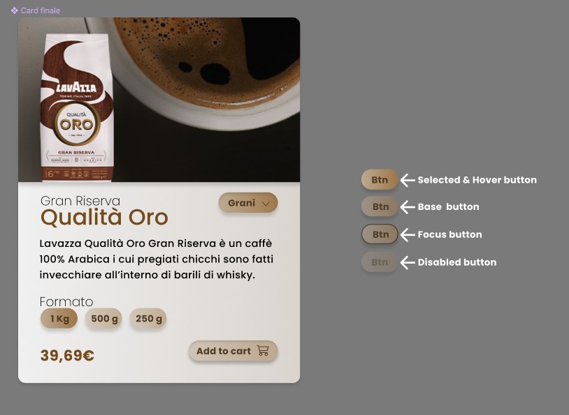

# ☕ Lavazza Product Card - Boolean Project

Questo è un mini-progetto sviluppato con **React** e **CSS base**, ispirato a un design da me creato su Figma come esercitazione per e nozioni apprese durante la specializzazione in Web Design.  
L'obiettivo era replicare **fedelmente** una card di prodotto Lavazza, curando layout, stili, tipografia e interattività, basandosi su un prototipo visuale.

---

## 🎯 Obiettivo del progetto

La card include i seguenti elementi:  
- **Immagine del prodotto**  
- **Nome**, **descrizione** e **formato selezionabile**  
- **Prezzo** e bottone **"Add to cart"**

Di seguito è mostrato il design di riferimento creato su Figma:  

---

## 🛠️ Tecnologie utilizzate

- **React** (Vite)
- **CSS base** (senza framework)
- File immagine esportato da Figma

---

> Progetto realizzato come esercizio personale per migliorare le competenze di sviluppo front-end partendo da un design UI.
